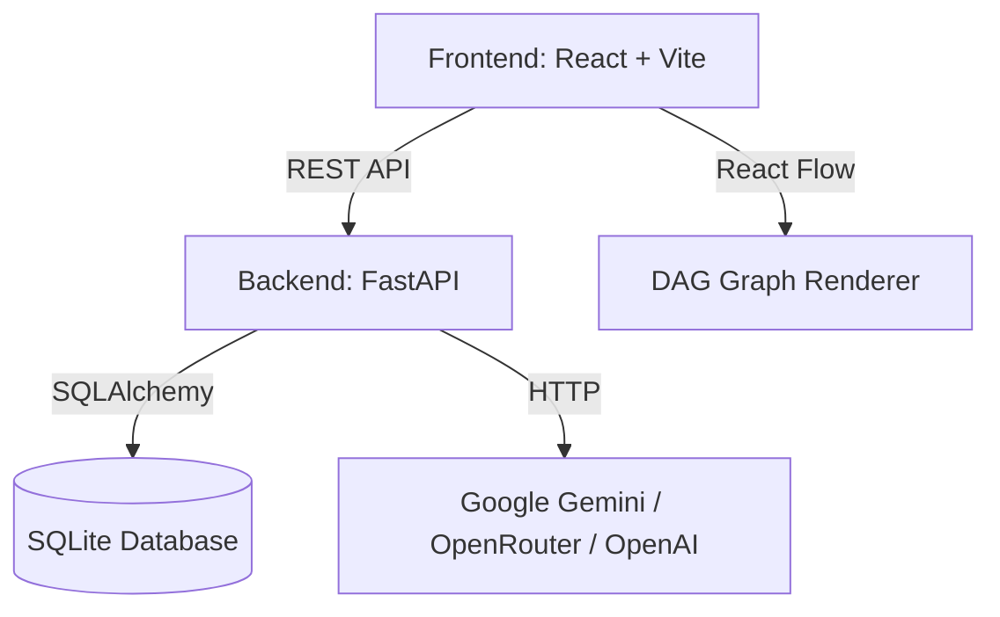
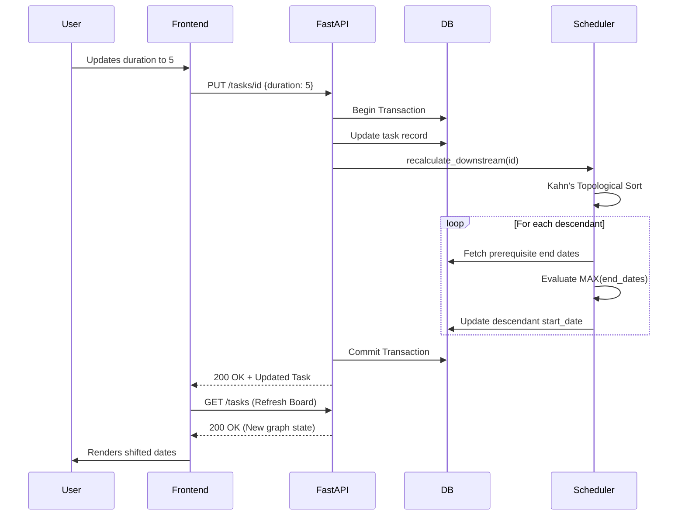
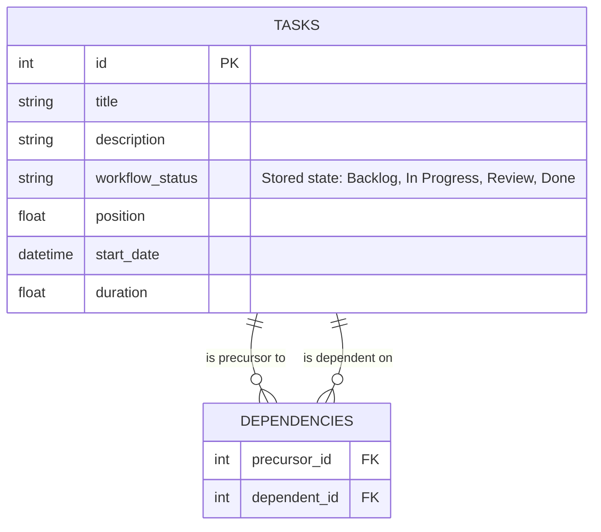

# Architecture & Design Document

## Requirements Traceability
| Requirement | How it is implemented | Where (File/Function) | How it was verified |
| --- | --- | --- | --- |
| 4-Column Kanban | Rendered via React state mapping over 4 arrays (`Backlog`, `In Progress`, `Review`, `Done`). | `frontend/src/App.tsx` (`renderColumn`) | Manually verified during development; re-run on the final build pending. |
| Drag-drop persistence | Updating a task triggers a `PUT /tasks/{id}/position` REST call committing the status. | `backend/main.py` (`update_task_position`) | Manually verified during development; re-run on the final build pending. |
| Explicit Dependencies | A junction table allows defining multi-parent, multi-child relationships. | `backend/database.py` (`Dependency` class) | Manually verified during development; re-run on the final build pending. |
| Dependency Status | Computed on-the-fly dynamically. If any prerequisite isn't 'Done', status is 'Blocked'. | `backend/scheduler.py` (`compute_dependency_status`) | Manually verified during development; re-run on the final build pending. |
| Downstream Propagation | Changing an upstream task recalculates all descendants topologically. | `backend/scheduler.py` (`recalculate_downstream`) | Automated tests in `backend/tests/test_scheduler.py`. |
| Cycle Rejection | A Depth-First Search algorithm prevents A->B->A patterns before DB commit. | `backend/scheduler.py` (`would_create_cycle`) | Automated tests in `backend/tests/test_scheduler.py` and `test_api.py`. |
| No-compounding | Start date leverages `MAX()` of all direct prerequisite finish dates. | `backend/scheduler.py` (`recalculate_downstream`) | Automated tests in `backend/tests/test_scheduler.py`. |
| Rollback | Removing a "Done" status causes children to instantly evaluate to "Blocked". | `backend/scheduler.py` (`compute_dependency_status`) | Automated tests in `backend/tests/test_scheduler.py` and `test_api.py`. |
| Critical Path | Iterates DAG to find the path with the longest total duration ending at the final node. | `backend/main.py` (`get_critical_path`) | Manually verified during development; re-run on the final build pending. |
| AI Suggestion | LLM processes tasks and returns a JSON payload of existing Task IDs as recommendations. | `backend/ai_suggest.py` (`suggest_dependencies_llm`) | Automated tests with mocked LLM responses; also exercised manually with a live OpenRouter key. |

## Architecture Overview
The system relies on a clean, horizontally decoupled boundary between the **React** client and the **FastAPI** backend. 

### Component Sequence: Editing a Task Duration
When a user updates a task's duration, a rigorous sequence ensures integrity across the DAG:

## Data Model
TaskFlow Pro uses a normalized schema with strict relational boundaries.

### `workflow_status` vs `dependency_status`
*   `workflow_status` is a **stored physical column** mapped explicitly to human actions ('Backlog', 'In Progress', 'Review', 'Done').
*   `dependency_status` is **never stored**. It is calculated dynamically during `GET /tasks`. This avoids massive synchronization risks when dependencies cascade, ensuring the read-state is always a pure function of the graph shape.

## Core Algorithms

1. **Cycle Detection (DFS)**
   *   *Rationale*: A cyclic graph cannot be scheduled. We must block cycles *before* they are written.
   *   *Complexity*: `O(V + E)` where `V` is tasks and `E` is dependencies.
   *   *Logic*: Recursively explores neighbors. If it encounters a neighbor currently in the active DFS path stack, a cycle exists.
2. **Kahn's Topological Sort**
   *   *Rationale*: When a duration changes, descendants must be updated in a strict order so that `C` is updated only after its prerequisites `A` and `B` have fully settled their new dates.
   *   *Complexity*: `O(V + E)`.
3. **No-Compounding Propagation**
   *   *Rationale*: A task cannot begin until *all* its prerequisites are complete. Therefore, `start_date = MAX(prerequisite.end_date)`. 
   *   *Complexity*: Computed linearly during the topological sort traversal.
4. **Critical Path Calculation**
   *   *Rationale*: Visualizing bottlenecks. 
   *   *Complexity*: `O(V + E)` using dynamic programming to track `earliest_finish` and a `predecessor` array to backtrack the longest route.

## Worked Examples
*   **The Diamond (Tasks 4, 5, 6, 7)**:
    Illustrative numbers consistent with the seeded durations (Task 4 = 1 day, Task 5 = 5 days, Task 6 = 3 days, Task 7 = 4 days): Task 4 starts day 0 and finishes day 1; Tasks 5 and 6 both start day 1; Task 5 finishes day 6 and Task 6 finishes day 4; Task 7 starts day 6 = MAX(6, 4), not 10 (the sum) or 4.
*   **Cycle Rejection**:
    If 1 -> 2 -> 3 exists, attempting 3 -> 1 triggers DFS. The traversal checks 3, finds 1, checks 1, finds 2, checks 2, finds 3. Because 3 is already in the recursion stack, it rejects the operation entirely.

## Error Handling & Transaction Strategy
The system wraps DAG manipulations in SQLAlchemy transactions. If `would_create_cycle()` returns true during a `POST /dependencies` request, FastAPI raises an `HTTPException(400)` *before* `db.commit()` is called. The frontend catches this and isolates the failure to a red toast notification (`hasError` flag), preventing subsequent success messages from misrepresenting the failure.

## AI Design
The "AI Dependency Assistant" uses an LLM to deduce logical graph connections.
*   **Prompt**: Sends the target task's details alongside a JSON array of all other tasks.
*   **Safety Constraints**: The prompt explicitly enforces returning *only* an array of integers representing existing Task IDs.
*   **Provider Selection**: Determined dynamically by inspecting the `LLM_API_KEY` format in `ai_suggest.py`:
    *   Keys starting with `sk-or-` route to OpenRouter using `openrouter/free`.
    *   Keys starting with `sk-` route to OpenAI using `gpt-3.5-turbo`.
    *   Otherwise, routes to Google's SDK using `gemini-2.0-flash`.
*   **Validation**: The backend parses the JSON, verifies the IDs exist in the DB, and runs the same DFS cycle-check algorithm against them before returning them to the user.
*   **Human-in-the-Loop**: The AI never commits to the database. It returns payload data to the UI, highlighting suggested chips that the human must explicitly review and save.

## Security
*   **CORS**: Configured strictly in `main.py` allowing only specified localhost origins.
*   **Secrets**: `LLM_API_KEY` is isolated in a `.env` file explicitly ignored by git.
*   **Validation**: Pydantic models automatically sanitize and type-check all incoming JSON bodies.
*   **Injection**: SQLAlchemy's ORM parameterizes all queries automatically.

## Scalability and Production Path (Future Work)
This project is currently scoped as a local zero-setup tool. A production path would require:
1.  **PostgreSQL**: Replacing SQLite for concurrent write performance.
2.  **Indexing**: Adding indexes on `precursor_id` and `dependent_id` for massive graphs.
3.  **Real Authentication**: Implementing JWT sessions and user roles, replacing the decorative mockup login screen.
4.  **Websockets**: Implementing live collaborative board updates for multi-user sync.
*(Note: These are explicitly future capabilities, not currently implemented).*

While `recalculate_downstream` computes a topological sort over all nodes in the graph, it optimizes database writes by only revisiting and updating the direct descendants (reachable subgraph) of the changed task.

## Business Impact
TaskFlow Pro transforms chaotic project execution by surfacing hidden dependencies natively in the planner. Concrete use cases include:
*   **Release Planning**: Quickly identifying whether a delayed feature will invisibly push the launch date of dependent modules.
*   **Onboarding & Migration Checklists**: Establishing strict required-order steps that prevent stakeholders from moving to step 3 before step 2 is fully resolved.
*   **Sprint Planning**: Understanding where one delayed ticket affects several other parallel paths of execution across the team.
*   **Impact Analysis**: Allowing managers to adjust a duration estimate and instantly preview the downstream schedule impact before committing resources.

**What it does not do:**
*   It does not perform resource or capacity planning.
*   It does not support live multi-user collaboration.
*   It does not feature real authentication or user roles.

## Assumptions & Limitations
*   Deleting a task removes only its own edges, does not auto-bridge remaining prerequisites/dependents.
*   When an upstream schedule changes, downstream tasks shift dates but keep their own duration unless manually changed.
*   A Blocked task can still be manually moved to Done by the user (with a confirmation warning) - the system doesn't hard-block workflow movement, only shows dependency status as a warning.
*   The login screen is a decorative UI mockup with no real authentication or user accounts.
*   SQLite is used for zero-setup persistence; a production deployment would migrate to PostgreSQL.
*   `dependency_status` checks only DIRECT prerequisites, not the full ancestor chain.
